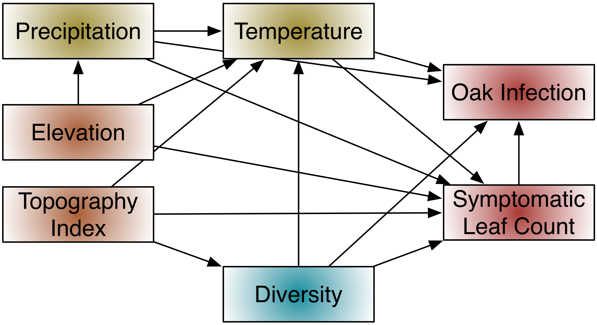

----

This appendix details steps 1-4 of calculating the *C*-statistic for fitting a path model in a generalized multilevel context (Shipley 2009). I go through these steps for the path models in Fig. 7 and Fig. 8 (included here)  to produce the regression equations that are indicated by the path diagram.

# The model in Fig. 7
## Step 1
Express the hypothesized causal relationships between the variables in the form of a directed acyclic graph (DAG).



## Step 2:
List each of the *k* pairs of variables in the graph that do not have an arrow directly between them. The topology of the graph indicates that these variables should be independent.

### Independence Set - Fig. 7

Variable 1 | Variable 2
--- | ---
Elevation | Topography index
Elevation | Oak infection
Topography | Precipitation
Topography | Oak infection
Diversity | Precipitation
Diversity | Elevation

## Step 3
For each of the *k* pairs of variables (*Xi,Xj*), list the set of other variables {*Z*} that are direct causes of either *Xi* or *Xj*. The pair of variables, (*Xi,Xj*), along with its conditioning set, {*Z*}, define an independence claim, (*Xi,Xj*) | {*Z*}, and the full set of the *k* independence claims defines the basis set, *Bu*. The basis set can be determined by using functions in the `R` package `ggm`.

First I will load the library and define the DAG using regression models and the `DAG` function. From the accompanying documentation: "The `DAG` function defines the adjacency matrix of a directed acyclic graph. An adjacency matrix is a square Boolean [e.g. 0/1] matrix that is equal to the number of nodes of the graph, with a one in a given position (i,j) if there is an arrow from i to j and zero otherwise. The row names of the adjacency matrix are the nodes of the DAG."
```{r define fig7 DAG, eval=TRUE, echo=TRUE}
library(ggm)
fig7 <- DAG(precip ~ elev, 
    diversity ~ topo,
    temp ~ precip + elev + topo + diversity,
    oak.inf ~ leaf.ct + diversity + temp + precip,
    leaf.ct ~ diversity + temp + precip + elev + topo)
```
I can apply the `basiSet` function to this DAG to generate the full set of independence claims.
```{r get fig 7 basis set, echo=TRUE, eval=TRUE}
bu_fig7 <- basiSet(fig7)
bu_fig7
```
I cleaned this list up into a table:

### The Basis Set of Independence Claims - Fig. 7

Independence Set | Conditioning Set
--- | ---
topo, elev | *empty*
topo, precip | elev  
topo, oak.inf | diversity, precip, temp, leaf.ct
diversity, elev | topo
diversity, precip | topo, elev
elev, oak.inf | diversity, precip, temp, leaf.ct

## Step 4
For each element in this basis set, obtain the _**exact**_ probability, *Pk* that the pair (*Xi,Xj*) is statistically independent conditional on the variables *Z*. In other words, perform a regression model using an appropriate method. Here I am only going to formulate the models because I am still in the process of calculating variables, so I do not have values for calculating probabilities of the coefficients. The predictor variable whose independence is being checked in each model is bolded - this is the variable for which the exact probability must be recorded. I also hazard an educated guess at the distribution family of the response variable for each model.

### Model Set - Fig. 7

Independence Set | Conditioning Set | Model | Distribution
--- | --- | --- | ---
topo, elev | *empty* | topo ~ **elev** + 1\|plot | *?*
precip, topo | elev | precip ~ elev + **topo** + 1\|plot + 1\|year | *?*
topo, oak.inf | diversity, precip, temp, leaf.ct | oak.inf ~ diversity + precip + temp + leaf.ct + **topo** + 1\|plot + 1\|year | *binomial*
diversity, elev | topo | diversity ~ topo + **elev** + 1\|plot | *?*
diversity, precip | topo, elev | diversity ~ topo + elev + **precip** + 1\|plot | *?*
elev, oak.inf | diversity, precip, temp, leaf.ct | oak.inf ~ diversity + precip + temp + leaf.ct + **elev** + 1\|plot + 1\|year | *binomial*

Noticeably, symptomatic leaf count is not part of the independence claims. If the complete model has sufficient fit then it would be modeled as either a Poisson or negative binomial distribution, and the coefficients applied to the appropriate paths.

This next step is currently not possible to do because I am still conducting data manipulations to calculate variables.

## Step 5 
Combine the *k* probabilities into the *C*-statistic:

$$
C = -2\Sigma_{i=1}^k ln(P_i)
$$ 
Compare this *C*-statistic to a $\chi^2$ distribution with 2*k* degrees of freedom. If the model fit according to this test is sufficient (i.e. p > 0.05), then the coefficients from these models may be applied to the appropriate paths.


# The model in Fig. 8

## Step 1
Express the hypothesized causal relationships between the variables in the form of a directed acyclic graph (DAG).


This model is indicates a direct modeling of a lag effect from precipitation, temperature, and symptomatic leaf count during the preceding year. Temperature, precipitation, and symptomatic leaf count of the current and preceding year influence the oak infection of the current year. Temperature and precipitation of the current and preceding year also influence the symptomatic leaf count of the current year. This is not explicitly clear in the currently simplified diagram, but will become so with the statement of the independence claims.

## Step 2
List each of the *k* pairs of variables in the graph that do not have an arrow directly between them. The topology of the graph indicates that these variables should be independent.

### Independence Sets - Fig. 8

Variable 1 | Variable 2
--- | ---
Elevation | Topography index
Elevation | Oak infection
Topography | Precipitation$_t$
Topography | Precipitation$_t-1$
Topography | Oak infection
Diversity | Precipitation$_t$
Diversity | Precipitation$_t-1$
Diversity | Elevation


## Step 3
For each of the *k* pairs of variables (*Xi,Xj*), list the set of other variables {*Z*} that are direct causes of either *Xi* or *Xj*. The pair of variables, (*Xi,Xj*), along with its conditioning set, {*Z*}, define an independence claim, (*Xi,Xj*) | {*Z*}, and the full set of the *k* independence claims defines the basis set, *Bu*. The basis set can be determined by using functions in the `R` package `ggm`.

```{r define fig 8 DAG, eval=TRUE, echo=TRUE}
library(ggm)
fig8 <- DAG(precip1 ~ elev, precip2 ~ elev, 
    diversity ~ topo,
    temp1 ~ precip1 + elev + topo + diversity,
    temp2 ~ precip2 + elev + topo + diversity,
    oak.inf ~ leaf.ct1 + leaf.ct2 + diversity + temp1 + temp2 + precip1 + precip2,
    leaf.ct1 ~ diversity + temp1 + precip1 + temp2 + precip2 + leaf.ct2 + elev + topo,
    leaf.ct2 ~ diversity + temp2 + precip2 + elev + topo)
```
Apply the `basiSet` function to this DAG to generate the full set of independence claims.
```{r get fig 8 basis set, echo=TRUE, eval=TRUE}
bu_fig8 <- basiSet(fig8)
```

### The Basis Set of Independence Claims - Fig. 8

Independence Set | Conditioning Set
--- | ---
topo, elev | *empty*
topo, precip1 | elev
topo, precip2 | elev
topo, oak.inf | diversity, precip1, temp1, leaf.ct1, precip2, temp2, leaf.ct2
diversity, elev | topo
diversity, precip1 | topo, elev
diversity, precip2 | topo, elev
elev, oak.inf | diversity, precip1, temp1, leaf.ct1, precip2, temp2, leaf.ct2
precip1, precip2 | elev
precip2, temp1 | elev, topo, diversity, precip1
temp2, precip1 | topo, diversity, elev, precip2
temp2, temp1 | topo, diversity, elev, precip2, precip1
leaf.ct2, precip1 | topo, diversity, elev, precip2, temp2
leaf.ct2, temp1 | topo, diversity, elev, precip2, temp2, precip1

## Step 4
For each element in this basis set, obtain the _**exact**_ probability, *Pk* that the pair (*Xi,Xj*) is statistically independent conditional on the variables *Z*.

### Model set - Fig. 8

Independence Set | Conditioning Set | Model | Distribution
--- | --- | --- | ---
topo, elev | *empty* | topo ~ **elev** + 1|plot | *?*
precip1, topo | elev | precip1 ~ elev + **topo** + 1\|plot + 1\|year | *?*
precip2, topo | elev | precip2 ~ elev + **topo** + 1\|plot + 1\|year | *?*
topo, oak.inf | diversity, precip1, temp1, precip2, temp2, leaf.ct | oak.inf ~ diversity + precip1 + temp1 + precip2 + temp2 + leaf.ct + **topo** + 1\|plot + 1\|year | *binomial*
diversity, elev | topo | diversity ~ topo + **elev** + 1\|plot | *?*
diversity, precip1 | topo, elev | diversity ~ topo + elev + **precip1** + 1\|plot | *?*
diversity, precip2 | topo, elev | diversity ~ topo + elev + **precip2** + 1\|plot | *?*
elev, oak.inf | diversity, precip1, temp1, precip2, temp2, leaf.ct1, leaf.ct2 | oak.inf ~ diversity + precip1 + temp1 + leaf.ct1 + precip2 + temp2 + leaf.ct2 + **elev** + 1\|plot + 1\|year | *binomial*
precip1, precip2 | elev | precip1 ~ elev + **precip2** + 1\|plot + 1\|year | *?*
precip2, temp1 | elev, topo, diversity, precip1 | temp1 ~ elev + topo + diversity + precip1 + **precip2** + 1\|plot + 1\|year | *?*
temp2, precip1 | topo, diversity, elev, precip2 | temp2 ~ topo + diversity + elev + precip2 + **precip1** + 1\|plot + 1\|year | *?*
temp2, temp1 | topo, diversity, elev, precip2, precip1 | temp1 ~ topo + diversity + elev + precip2 + precip1 + **temp2** + 1\|plot + 1\|year | *?*
leaf.ct2, precip1 | topo, diversity, elev, precip2, temp2 | leaf.ct2 ~ topo + diversity + elev + precip2 + temp2 + **precip1** + 1\|plot + 1\|year | *Poisson*
leaf.ct2, temp1 | topo, diversity, elev, precip2, temp2 + precip1 | leaf.ct2 ~ topo + diversity + elev + precip2 + temp2 + precip1 + **temp1** + 1\|plot + 1\|year | *Poisson*