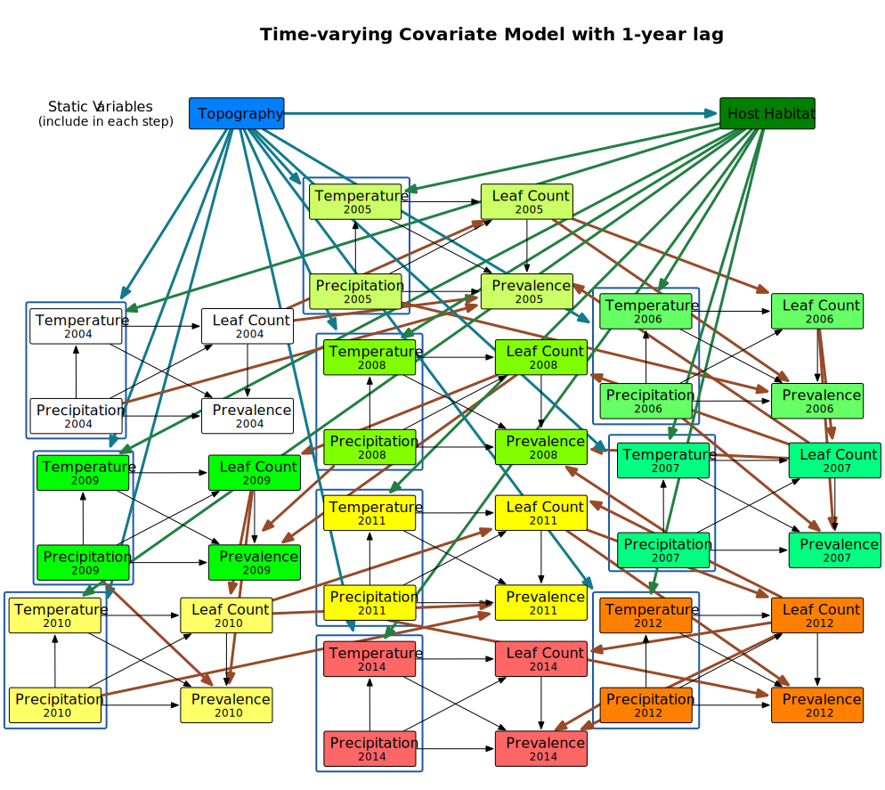

## Steps for Performing a d-Sep Test
###### (Shipley 2000, 2003, 2004, 2009)

1. Express the hypothesized causal relationships between the variables in the form of a directed acyclic graph

2. List each of the *k* pairs of variables in the graph that do not have an arrow between them:

	Row |Variable Pairs 1 | Variable Pairs 2 | Variable Pairs 3
--- | --- | --- | ---
1|*Topography, Leaf Count* | *Topography, Prevalence* | *Host Habitat, Precipitation*
2|*Temp2004, Temp2005*|*Temp2004, Precip2005*|*Precip2004, Precip2005*
3|*Temp2004, Temp2006*|*Temp2004, Precip2006*|*Precip2004, Precip2006*
4|*Temp2004, Temp2007*|*Temp2004, Precip2007*|*Precip2004, Precip2007*
5|*Temp2004, Temp2008*|*Temp2004, Precip2008*|*Precip2004, Precip2008*
6|*Temp2004, Temp2009*|*Temp2004, Precip2009*|*Precip2004, Precip2009*
7|*Temp2004, Temp2010*|*Temp2004, Precip2010*|*Precip2004, Precip2010*
8|*Temp2004, Temp2011*|*Temp2004, Precip2011*|*Precip2004, Precip2011*

This is just an example of what part of this table would look like. I can use the `ggm` package to find the entire list and define the basis set as described below.

3. For each of the *k* pairs of variables (*Xi,Xj*), list the set of other variables, {*Z*} that are direct causes of either *Xi* or *Xj*. The pair of variables, (*Xi,Xj*), along with its conditioning set, {*Z*}, define an independence claim, (*Xi,Xj*) | {*Z*}, and the full set of the *k* independence claims defines the basis set, *Bu*. 

4. For each element in this basis set, obtain the _**exact**_ probability, *Pk* that the pair (*Xi,Xj*) is statistically independent conditional on the variables *Z*. In other words, perform a regression model using an appropriate method.

5. Combine the *k* probabilities into the *C*-statistic:

$$
C = -2\Sigma_{i=1}^k ln(P_i)
$$ 

This methodology can be extended into the mixed-model context using standard statistical programs with these capabilities, because you are testing multiple regressions hypothesized to be independent of each other. If too many independence claims are violated, then the model will be found to not fit the data.

It is also possible to apply this method to multilevel Bayesian (MCMC) models (McCarthy 2007) by testing the independence of the partial slopes and determining the 95% credible intervals.

### Example from Shipley 2009 on how to perform the d-sep test in a generalized multilevel context 
This is to demonstrate how to assess a multilevel, repeated measures path model by applying mixed models in the tests of d-separation. I am using the supplementary material, including the data provided.

##### Path Model
`Latitude` --> `Degree-days` --> `Date of bud burst` --> `Growth` --> `Live`

Load the two libraries and read in the data Shipley uses
```{r load libraries, eval=TRUE, message=FALSE}
library(nlme)
library(lme4)# masked lmList from nlme package
data1 <- read.table("d_sep_ex/shipley2009.dat")
str(data1)
summary(data1)
head(data1)
```
Shipley (2009) describes these data in the text as a study beginning in 1970 where 20 sites are chosen with different latitudes. Five individual trees are chosen within each site, and each tree is followed every second year until 2006 or death. In each site, each year, for each individual four measurements are recorded: 

   1. `DD` - the number of growing degree days until bud break
   2. `Date` - the Julian date (day of year) of bud break
   3. `Growth` - individual tree growth (change in diameter)
   4. `Live` - binary indicator of survival (1) or death (0)

I am now going to load the `ggm` library for identifying the directed acyclic graph and defining the basis set (a.k.a. the condition independence claims) without writing it out by hand. 

"The `DAG` function defines the adjacency matrix of a directed acyclic graph. An adjacency matrix is a square Boolean [e.g. 0/1] matrix that is equal to the number of nodes of the graph, with a one in a given position (i,j) if there is an arrow from i to j and zero otherwise. The row names of the adjacency matrix are the nodes of the DAG."

This means composing each the regressions between variables directly connected by arrows in the graph, which is pretty easy in this simple example because each variable has no more than one direct cause. 

```{r get basis set, eval=TRUE}
library(ggm)
dag <- DAG(Live ~ Growth, Growth ~ Date, Date ~ DD, DD ~ Latitude)
isAcyclic(dag)# Logical test to check if the translated graph is acyclic, though a cyclic graph should return a warning, e.g.:
DAG(x~y, y~z, z~x)
Bu <- basiSet(dag)# Get the basis set as a list of vectors. The first two items of each vector are the names of the two non-adjacent nodes, followed by the names of the nodes in the conditioning set, which may be empty (though not in this instance).
```

Following the directions of the Shipley (2009) supplement I will fit separate mixed models for each independence claim in the basis set. 
```{r print basis set, echo=TRUE}
print(Bu)
```
Six claims equals six models. The first two variables listed in each item are claimed to be independent based on the following set of zero or more variables.

The first independence claim is that `Date` is independent of `Latitude` after controlling for `DD`. So, I need to obtain the *precise* null probability for this claim. Choosing the correct modeling procedure requires identifying the appropriate distribution of the dependent variable, in this case `Date`. Using some helper fucntions and the `pairs()` function in the base `graphics` package I can look at the correlations and distributions simultaneously.
```{r helper functions for scatterplot matrix, echo=FALSE}
# These were copied from the help pages of the `pairs` function with minor alterations

# Make histograms to put in the diagonal panel
panel.hist <- function(x, ...)
{
    usr <- par("usr"); on.exit(par(usr))
    par(usr = c(usr[1:2], 0, 1.5) )
    h <- hist(x, plot = FALSE)
    breaks <- h$breaks; nB <- length(breaks)
    y <- h$counts; y <- y/max(y)
    rect(breaks[-nB], 0, breaks[-1], y, col = "cyan", ...)
}

# Print absolute correlations in either upper or lower panel; size proportianal to magnitude of the correlation
panel.cor <- function(x, y, digits = 2, prefix = "", cex.cor, ...)
{
    usr <- par("usr"); on.exit(par(usr))
    par(usr = c(0, 1, 0, 1))
    r <- abs(cor(x, y, use="na.or.complete"))
    txt <- format(c(r, 0.123456789), digits = digits)[1]
    txt <- paste0(prefix, txt)
    if(missing(cex.cor)) cex.cor <- 0.8/strwidth(txt)
    text(0.5, 0.5, txt, cex = cex.cor * r)
}
```
```{r correlations & distributions}
#pairs(subset(data1, select = c(lat, Date, DD, Growth, Live)), diag.panel = panel.hist, lower.panel = panel.cor)
sub_data1 <- data1[ ,c(3,5:7,9)] #subset(data1, , select = c("lat","Date","DD","Growth","Live"))
#library(dplyr)
#sub_data1 <- data1 %>% select(lat, Date, DD, Growth, Live)

pairs(sub_data1, diag.panel = panel.hist, lower.panel = panel.cor)
```

The `Date` variable appears close to a normal distribution, so either the `lmer()` in the `lme4` package or the `lme()` function in the `nlme` package are appropriate. Shipley says that the `lme()` prints out degrees of freedom but `lmer()` does not. I am going to check to see if that is still true.
```{r independence claim 1 test}
fit1 <- lme(Date ~ DD + lat, data = data1, 
            random = ~1|site/tree, 
            na.action = na.omit)
fit1lme4 <- lmer(Date ~ DD + lat + (1|site) + (1|tree), data = data1,
                 na.action = na.omit)
summary(fit1)
summary(fit1lme4)
```
It is correct that `lmer()` does not provide degrees of freedom, and thus no probability estimate (p-value) for the coefficients. Aside from that it appears that the values estimate from both algorithms match up very well. Based on these results the null probability of observing a t-value at least as extreme for latitude (`lat`) is 0.9373, so pretty darn likely. That means that this independence claim is supported by the data.

Now to do the same for the other normally distributed dependent variables
```{r independence claim test 2 & 3}
# Independence of Growth and lat conditioned on Date
fit2 <- lme(Growth ~ Date + lat, data = data1, 
            random = ~1|site/tree, 
            na.action = na.omit)
# Independence of Growth and DD conditioned on Date and lat
fit3 <- lme(Growth ~ Date + lat + DD, data = data1, 
            random = ~1|site/tree, 
            na.action = na.omit)
```

The other three independence claims have `Live` as the dependent variable. This is binary so I need to use the binomial error distribution with the logit link, requiring the `lmer()` function.
```{r binomial independence claim Live & lat}
# Independence of Live and lat conditioned on Growth
fit4 <- glmer(Live ~ scale(Growth) + scale(lat) + (1|site) + (1|tree),
             data = data1, na.action = na.omit, family = binomial)
summary(fit4)
```
This currently throws a warning about a large eigenvalue ratio with suggestion to rescale the variables.

Some of the current estimates are fairly different from those shown in the Shipley supplement, particularly for standard errors, z-values, and p-values. The actual coefficient estimates are much more similar. Nonetheless, the interpretation that the independence claim is supported holds true, with a null probability for observing a z-value associated with `lat` at least that extreme equaling 0.304.

Now to test the remaining independence claims, `Live` & `DD` conditioned on `Growth` & `lat`, and `Live` & `Date` conditioned on `DD` & `Growth`.
```{r binomial independence claims 5 & 6}
# Independence of Live and DD conditioned on Growth and lat
fit5 <- glmer(Live ~ scale(Growth) + scale(lat) + scale(DD) + (1|site) + (1|tree),
             data = data1, na.action = na.omit, family = binomial)
# Indpendence of Live and Date conditioned on DD and Growth
fit6 <- glmer(Live ~ scale(Growth) + scale(DD) + scale(Date) + (1|site) + (1|tree),
             data = data1, na.action = na.omit, family = binomial)
summary(fit6)
```
Again got warnings about large eigenvalues, as well as failure of the model to converge, with suggestion to rescale the variables.

Now I want to get the fixed-effects summaries for each model, and in particular the null probability estimates (p-values) for the pair of variables in each independence claim.
```{r nlme model & probability summaries}
# These four lines were to help me figure out how to access the right part of the summary object
#sum_fit1 <- summary(fit1)
#str(sum_fit1)
#sum_fit1$coefficients$fixed# Same as fixed.effects(fit1)
#sum_fit1$tTable# Gets the full t-test table including coefficient estimates and probabilities
summary(fit1)$tTable# lat, Date independence
```
```{r}
summary(fit2)$tTable# Growth, lat independence
```
```{r}
summary(fit3)$tTable# Growth, DD indpendence
```

```{r lme4 model & probability summaries}
#sum_fit4 <- summary(fit4)
#str(sum_fit4)
#sum_fit4$coefficients
summary(fit4)$coefficients# Independence of Live and lat 
```
```{r}
summary(fit5)$coefficients# Independence of Live and DD
```
```{r}
summary(fit6)$coefficients# Independence of Live and Date
```

Create a vector of the probabilities for the independence claims (6 values).
```{r vector of probabilities}
pvalues <- c(summary(fit6)$coefficients[4,4], summary(fit5)$coefficients[4,4],
             summary(fit4)$coefficients[3,4], summary(fit3)$tTable[3,5],
             summary(fit2)$tTable[3,5], summary(fit1)$tTable[3,5])
print(pvalues)
```
These values do not all match up with the estimates printed in Table 2 of Shipley (2009). Assuming I did the modeling correctly (a substantial assumption), what gives?

Combine the p-values into the *C*-statistic and see what we get anyway.
```{r calculate C statistic}
ln_pvalues <- log(pvalues)
C_stat <- -2*sum(ln_pvalues)
print(C_stat)
```
Checking this value in a $\Chi^2$ look up table against 2*k*(12) degrees of freedom provides an estimated probability of a larger value being somewhere between 0.25 and 0.50.

I would like to learn how to calculate the chi-square cumulative probability based on the degrees of freedom and *C*-statistic, a la the handy tool on this [website](http://stattrek.com/online-calculator/chi-square.aspx).

It's probably simple...

The tool from this website calculates the probability of observing a value smaller than this as 0.63, indicating the probability of observing a larger value is 0.37.
