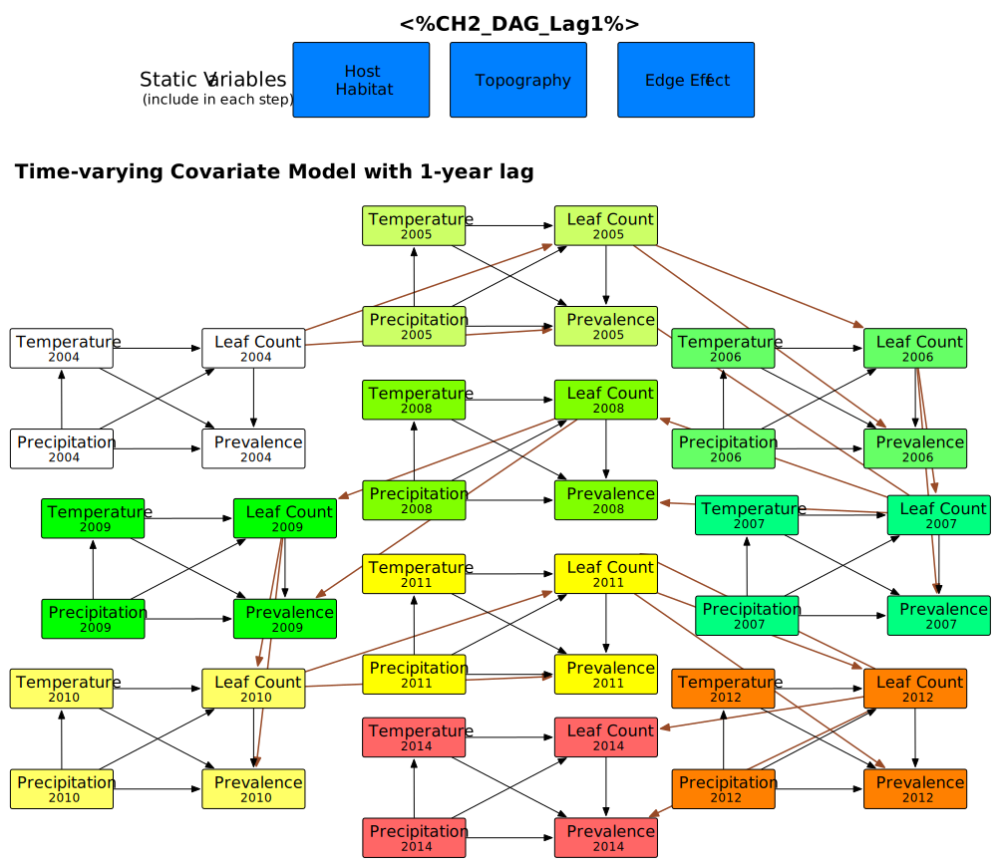

Steps for Performing a d-Sep Test (Shipley 2000, 2003, 2004, 2009)

1. Express the hypothesized causal relationships between the variables in the form of a directed acyclic graph

2. List each of the *k* pairs of variables in the graph that do not have an arrow between them:

|**Variable Pairs 1** | **Variable Pairs 2** | **Variable Pairs 3**|
|---- | ---- | ----|

|*Topography, Leaf Count* | *Topography, Prevalence* | *Host Habitat, Precipitation*

	*Temp2004, Temp2005*
	*Temp2004, Temp2006*
	*Temp2004, Temp2007*
	*Temp2004, Temp2008*
	*Temp2004, Temp2009*
	*Temp2004, Temp2010*
	*Temp2004, Temp2011*
	*Temp2004, Temp2012*
	*Temp2004, Temp2014*
	*Temp2004, Precip2005*
	*Temp2004, Precip2006*
	*Temp2004, Precip2007*
	*Temp2004, Precip2008*
	*Temp2004, Precip2009*
	*Temp2004, Precip2010*
	*Temp2004, Precip2011*
	*Temp2004, Precip2012*
	*Temp2004, Precip2014*
	*Precip2004, Precip2005*
	*Precip2004, Precip2006*
	*Precip2004, Precip2007*
	*Precip2004, Precip2008*
	*Precip2004, Precip2009*
	*Precip2004, Precip2010*
	*Precip2004, Precip2011*
	*Precip2004, Precip2012*
	*Precip2004, Precip2014*

3. For each of the *k* pairs of variables (*Xi,Xj*), list the set of other variables, {*Z*} that are direct causes of either *Xi* or *Xj*. The pair of variables, (*Xi,Xj*), along with its conditioning set, {*Z*}, define an independence claim, (*Xi,Xj*) | {*Z*}, and the full set of the *k* independence claims defines the basis set, *Bu*. 
4. For each element in this basis set, obtain the probability, *Pk* that the pair (*Xi,Xj*) is statistically independent conditional on the variables *Z*. In other words, perform a regression model using an appropriate method.
5. Combine the *k* probabilities into the *C*-statistic:

This methodology can be extended into the mixed-model context using standard statistical programs with these capabilities, because you are testing multiple regressions hypothesized to be independent of each other. If too many independence claims are violated, then the model will be found to not fit the data.

It is also possible to apply this method to multilevel Bayesian (MCMC) models (McCarthy 2007) by testing the independence of the partial slopes and determining the 95% credible intervals. 

