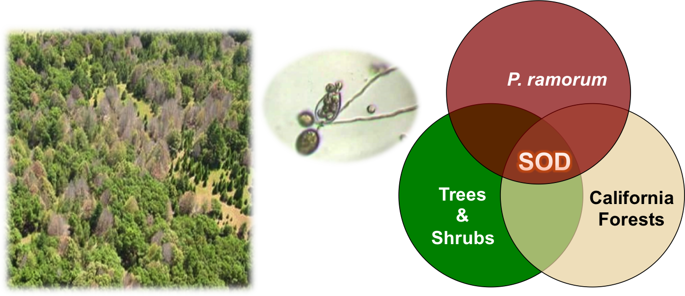

---
output:
  slidy_presentation:
    font_adjustment: 1
    footer: Center for Geospatial Analytics at NCSU
    highlight: haddock
    keep_md: yes
  beamer_presentation:
    highlight: haddock
---

## Searching for Superspreaders

**Whalen Dillon**

May 7, 2015


## Emerging Infectious Diseases

New in a population, or new but rapidly increasing 


## Disease Triangle


## Sudden Oak Death Triangle



## Sudden Oak Death Hosts & Environment

46 wildland host species - 5 key host tree species


## Pathogen Spillover

**“when disease epidemics are driven by transmission from an alternate reservoir host population” – Power & Mitchell (2004)**

- characteristic of multihost disease systems


## Superspreaders

Individual(s) that disproportionately contribute to disease transmission
 
- potential mechanism for pathogen spillover
 


## Searching for superspreaders

The 90%, 95%, and 99% quantile threshold values for each year
```{r Look at potential outliers, echo=FALSE, message=FALSE, results='asis'}
load("~/GitHub/superspreaders/stem_level_data.RData")
library(plyr); library(dplyr); library(xtable)
tab <- xtable(bay_laurel %>% select(plot, tag, slc, status, year) %>% 
      filter(status == "Alive") %>%
      group_by(year) %>% 
      summarise(#slc80 = quantile(slc, 0.80, na.rm = T),
                #slc85 = quantile(slc, 0.85, na.rm = T), 
                slc90 = quantile(slc, 0.90, na.rm = T), 
                slc95 = quantile(slc, 0.95, na.rm = T),
                slc99 = quantile(slc, 0.99, na.rm = T)))
print(tab, type = "html")
```

```{r Subset data to potential outliers each year, echo=FALSE}
slc90q <- bay_laurel %>% group_by(year) %>% 
      filter(year == 2004 & slc >= 82 | year == 2005 & slc >= 63 | 
                   year == 2006 & slc >= 112 | year == 2007 & slc >= 72 | 
                   year == 2008 & slc >= 62 | year == 2009 & slc >= 65 | 
                   year == 2010 & slc >= 104 | year == 2011 & slc >= 166 |
                   year == 2012 & slc >= 126 | year == 2014 & slc >= 93)

slc95q <- bay_laurel %>% group_by(year) %>% 
      filter(year == 2004 & slc >= 114 | year == 2005 & slc >= 88 | 
                   year == 2006 & slc >= 130 | year == 2007 & slc >= 86 | 
                   year == 2008 & slc >= 76 | year == 2009 & slc >= 83 | 
                   year == 2010 & slc >= 139 | year == 2011 & slc >= 190 |
                   year == 2012 & slc >= 155 | year == 2014 & slc >= 128)

slc99q <- bay_laurel %>% group_by(year) %>%
      filter(year == 2004 & slc >= 178 | year == 2005 & slc >= 127 | 
                   year == 2006 & slc >= 174 | year == 2007 & slc >= 113 | 
                   year == 2008 & slc >= 110 | year == 2009 & slc >= 119 | 
                   year == 2010 & slc >= 191 | year == 2011 & slc >= 214 |
                   year == 2012 & slc >= 200 | year == 2014 & slc >= 181)
      
```

## Slide with Plot

```{r, echo=FALSE}

```

## Species and Locations as Superspreaders

Disease hotspots as "superspreaders"


