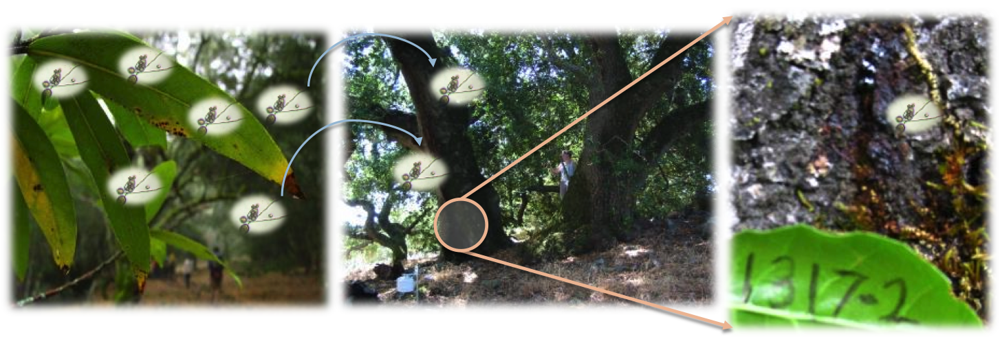

---
output:
  slidy_presentation:
    font_adjustment: 1
    footer: Center for Geospatial Analytics at NCSU
    highlight: haddock
    keep_md: yes
  beamer_presentation:
    highlight: haddock
---

## Searching for Superspreaders

**Whalen Dillon**

May 7, 2015


## Emerging Infectious Diseases

New in a population, or new but rapidly increasing 


## Disease Triangle


## Sudden Oak Death Triangle


## Sudden Oak Death Hosts & Environment

46 wildland host species - 5 key host tree species


## Pathogen Spillover

**“when disease epidemics are driven by transmission from an alternate reservoir host population” – Power & Mitchell (2004)**
- characteristic of multihost disease systems



## Superspreaders

Individual(s) that disproportionately contribute to disease transmission
 - potential mechanism for pathogen spillover
 


## Searching for superspreaders


```{r}
summary(cars)
```

## Slide with Plot

```{r, echo=FALSE}
plot(cars)
```

## Species and Locations as Superspreaders

Disease hotspots as "superspreaders"


