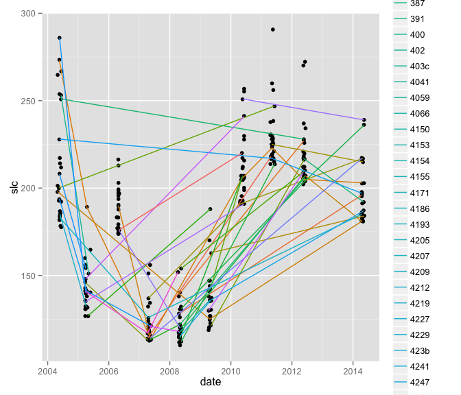

## Searching for Superspreaders

**Whalen Dillon**

May 7, 2015


## Emerging Infectious Diseases

New in a population, or new but rapidly increasing 


## Slide with Bullets

- Bullet 1
- Bullet 2
- Bullet 3

## Slide with R Code and Output


```r
summary(cars)
```

```
##      speed           dist       
##  Min.   : 4.0   Min.   :  2.00  
##  1st Qu.:12.0   1st Qu.: 26.00  
##  Median :15.0   Median : 36.00  
##  Mean   :15.4   Mean   : 42.98  
##  3rd Qu.:19.0   3rd Qu.: 56.00  
##  Max.   :25.0   Max.   :120.00
```

## Slide with Plot

 

