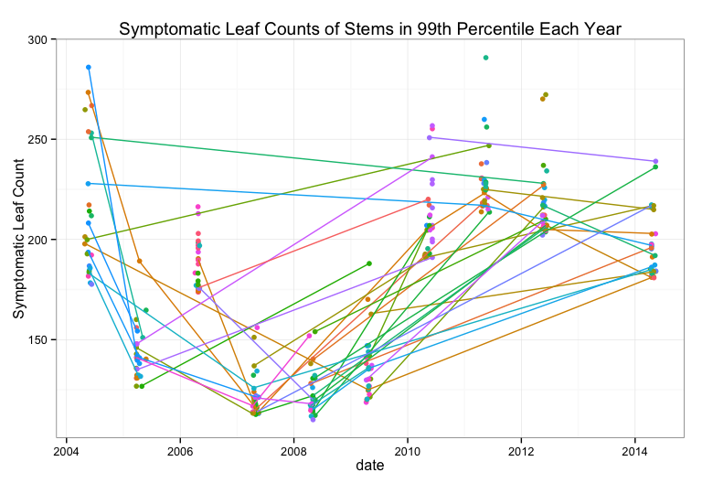

## Searching for Superspreaders

**Whalen Dillon**

May 7, 2015


## Emerging Infectious Diseases

New in a population, or new but rapidly increasing 


## Disease Triangle


## Sudden Oak Death Disease Triangle


## Sudden Oak Death Hosts & Environment

46 wildland host species - 5 key host tree species


## Pathogen Spillover

**“when disease epidemics are driven by transmission from an alternate reservoir host population”** 
 
-- Power & Mitchell (2004) *Pathogen spillover in disease epidemics*


A common characteristic of multihost disease systems
 
## Superspreaders

Individual(s) that disproportionately contribute to disease transmission
 
 -- potential mechanism for pathogen spillover
 


Number of bay stems in the study alive during at least one sampling year: **2993**

## Searching for superspreaders

The 90%, 95%, and 99% quantile threshold values for each year
<!-- html table generated in R 3.1.3 by xtable 1.7-4 package -->
<!-- Thu May  7 12:55:15 2015 -->
<table border=1>
<tr> <th>  </th> <th> year </th> <th> slc90 </th> <th> slc95 </th> <th> slc99 </th>  </tr>
  <tr> <td align="right"> 1 </td> <td align="right"> 2003 </td> <td align="right"> 66.20 </td> <td align="right"> 78.00 </td> <td align="right"> 140.20 </td> </tr>
  <tr> <td align="right"> 2 </td> <td align="right"> 2004 </td> <td align="right"> 82.00 </td> <td align="right"> 114.00 </td> <td align="right"> 178.00 </td> </tr>
  <tr> <td align="right"> 3 </td> <td align="right"> 2005 </td> <td align="right"> 62.00 </td> <td align="right"> 87.00 </td> <td align="right"> 127.00 </td> </tr>
  <tr> <td align="right"> 4 </td> <td align="right"> 2006 </td> <td align="right"> 112.00 </td> <td align="right"> 130.00 </td> <td align="right"> 174.00 </td> </tr>
  <tr> <td align="right"> 5 </td> <td align="right"> 2007 </td> <td align="right"> 71.00 </td> <td align="right"> 86.00 </td> <td align="right"> 113.00 </td> </tr>
  <tr> <td align="right"> 6 </td> <td align="right"> 2008 </td> <td align="right"> 62.00 </td> <td align="right"> 76.00 </td> <td align="right"> 109.81 </td> </tr>
  <tr> <td align="right"> 7 </td> <td align="right"> 2009 </td> <td align="right"> 65.00 </td> <td align="right"> 83.00 </td> <td align="right"> 119.17 </td> </tr>
  <tr> <td align="right"> 8 </td> <td align="right"> 2010 </td> <td align="right"> 103.00 </td> <td align="right"> 138.50 </td> <td align="right"> 191.00 </td> </tr>
  <tr> <td align="right"> 9 </td> <td align="right"> 2011 </td> <td align="right"> 166.00 </td> <td align="right"> 190.00 </td> <td align="right"> 214.04 </td> </tr>
  <tr> <td align="right"> 10 </td> <td align="right"> 2012 </td> <td align="right"> 126.00 </td> <td align="right"> 155.00 </td> <td align="right"> 199.75 </td> </tr>
  <tr> <td align="right"> 11 </td> <td align="right"> 2014 </td> <td align="right"> 93.00 </td> <td align="right"> 128.00 </td> <td align="right"> 181.00 </td> </tr>
   </table>

## Searching for superspreaders
 


## Searching for Superspreaders - Stems in the 99th Percentile

Number of observations in 99th percentiles: **272**

 

Number of unique stems in 99th percentiles: **217**

## Stems in the 99th Percentile 2+ Years

```r
d <- subset(slc99q, duplicated(slc99q$tag) | duplicated(slc99q$tag, fromLast = T))
d <- arrange(d, tag, year)
d
```

```
## Source: local data frame [97 x 5]
## 
##       plot  tag year       date slc
## 1    ANN24 1418 2007 2007-04-12 114
## 2    ANN24 1418 2011 2011-04-26 218
## 3    SDC03 1842 2008 2008-04-19 128
## 4    SDC03 1842 2014 2014-04-16 196
## 5  REDDE01  189 2008 2008-05-03 140
## 6  REDDE01  189 2012 2012-05-22 227
## 7   JLSP03 2100 2004 2004-05-19 273
## 8   JLSP03 2100 2005 2005-04-14 189
## 9   JLSP03 2100 2007 2007-05-19 114
## 10  JLSP03 2100 2010 2010-05-05 205
## ..     ...  ...  ...        ... ...
```

## Stems in the 99th Percentile 2+ Years
 

Number of unique stems in the 99th percentile 2+ years: **42**

## Stems in the 99th Percentile 3+ Years


Number of unique stems in the 99th percentile 3+ years: **9**


 

## Species and Locations as Superspreaders

More symptoms due to:
 
 - individual characteristics
 - environmental characteristics
 - pathogen characteristics


Disease hotspots as "superspreaders"

